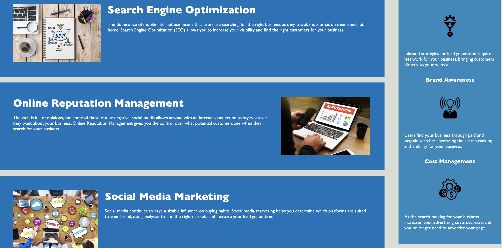

# Code Refactor

## Description

Webpage accessibility is an important part of building web applications. The greater accessibility it has, the greater it's reach. The goal of this project was to to improve the accessibility of Horiseon's landing page. The HTML file needed to include more semantic tags and the images were lacking alt attributes. I changed most of the ```<div>``` tags and replaced them with semantic HTML tags, such as ```<header>```, ```<nav>```, ```<section>```, ```<main>```, ```<aside>```, and ```<footer>```. These tags help people with access to the page through screen readers to have a better idea of which part of the page they are interacting with at one point in time. It also improves the SEO, giving it even greater reach on search engines, such as Google and Yahoo. I added an alt and title attribute to all of the image files that were linked in the HTML file for this same reason. I added a descriptive title to the ```<head>``` of the page and added appropriate id's so that the links would work properly in the navigation bar.

To increase the efficiency of the CSS stylesheet, selectors and properties needed to be consolidated so that there was no unnecessary repetition throughout the file. This required that I change some of the class attribute names in the HTML file. I also rearranged the order of the CSS selectors so that it would match the order of the elements as they appeared in the HTML file.

## Link

The deployed application can be found at https://kelseybrianne.github.io/horiseon/. 

## Screenshot


